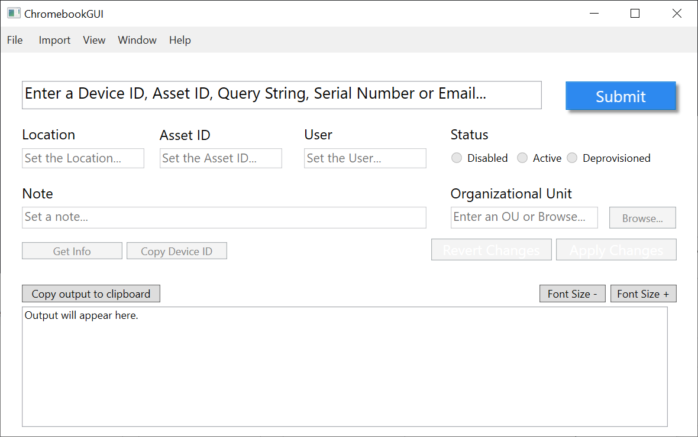
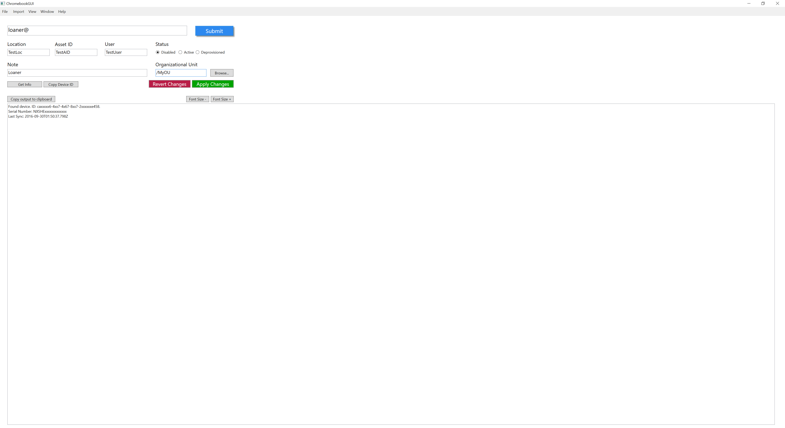
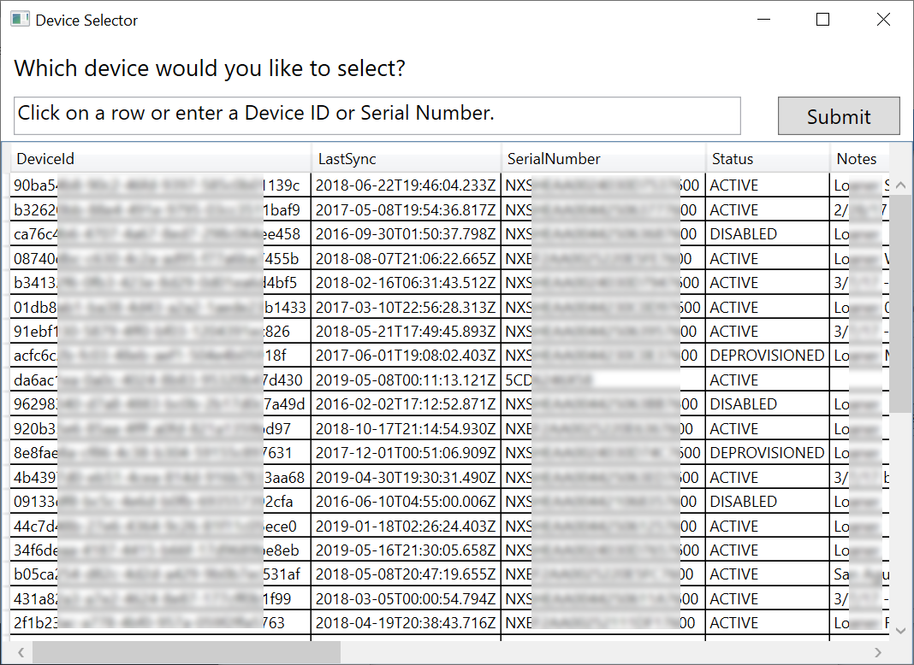
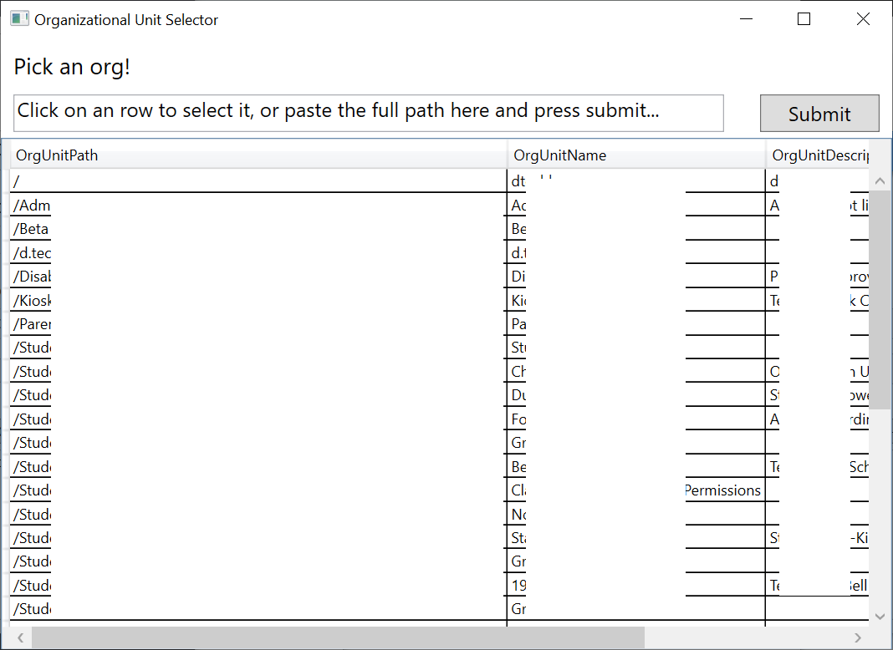
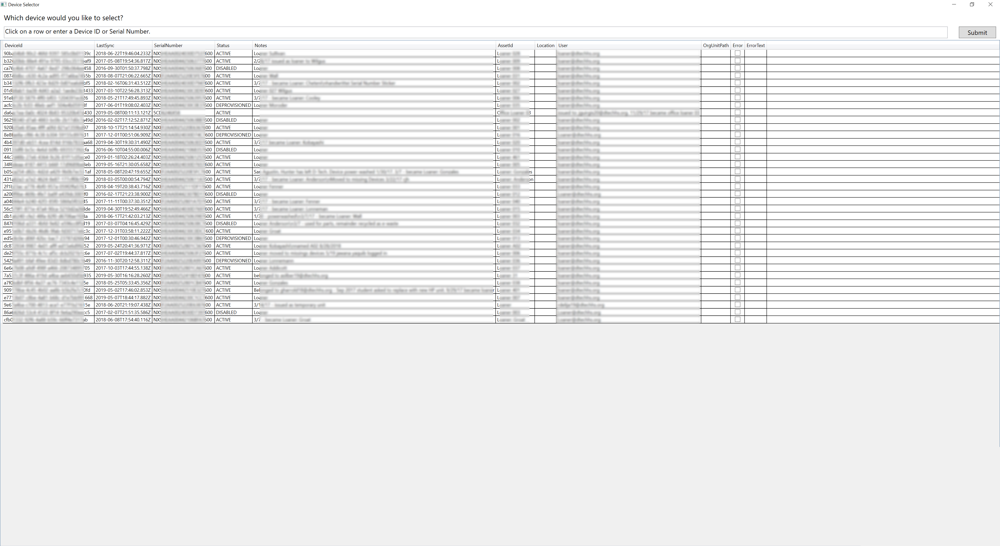
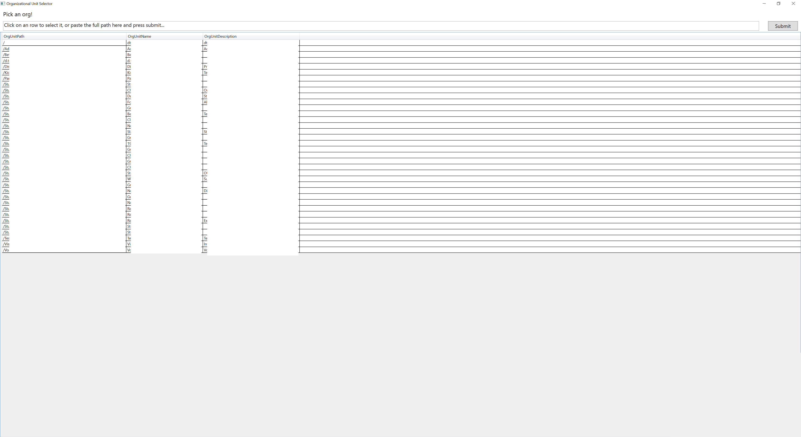

# gam-cros-win-wrapper
## A simple Chromebook management app.

This simple Chromebook management app makes it easy to perform simple Chrome OS Google Admin Console tasks. It's a native app for windows written in C#.

- [Install](#installation)
- [Usage](#usage)
- [Screenshots](#screenshots)
- [Bug reporting](#bug-reporting)
- [Contributing](#contributions)
- [Privacy policy](/PrivacyPolicy.md)

## What's new?
- 🎉 **Brand new interface!** (although, the old one is still available.)
- ⏩ **Greatly improved performance!** (no more 'Not Responding')
- 🏁 **Autocomplete in the Omnibar!**
- ⚠ Automated error reporting! (to [sentry.io](https://sentry.io), see our privacy policy [here](/PrivacyPolicy.md))
- 🐛 fixes!
- 📚 Much, much more.

## Installation

#### This app **requires** GAM, from [here](https://github.com/jay0lee/gam).

Before running, make sure that you can run `gam print cros` and from that command you get a bunch of 36 character ids, like this: `90a79523-658p-686y-bf20-19638646153c`. `gam` must be in your PATH.

Please make sure your current installed version of GAM is compatible with your current version of ChromebookGUI. Visit the [GAM Compatibility Chart](/GAMCompatibility.md), and use `gam version` to check your version.

### Release build (best for most people)

This is the most stable, tested version of ChromebookGUI. If you're not terribly
technical (or just don't want to deal with as many bugs), this is right for you.

Hop on over to the [releases page](https://github.com/iamtheyammer/gam-cros-win-wrapper/releases/latest) page to download.

### Beta build (fairly stable)

Beta is a little less tested than Release. If you want new features but a usable
(probably) experience, beta is for you.

Installation of **beta** is simple. Just pop on over to the [**beta** releases page](https://github.com/iamtheyammer/gam-cros-win-wrapper/releases/latest), and download the msi. It should run on both x86 and x64 platforms.

[Compatible GAM version: latest (4.82)](GAMCompatibility.md)

### Alpha build (less stable)

Want newest features first? Alpha is for you. If you download an alpha build,
please note that it may crash and bugs ~~may~~ occur.

Please, if you find a bug, report it as an issue.

To download the latest **alpha** build (again: not verified stable, but *should* work), download the MSI from [here](/ChromebookGUI/Installer/Tool+Installer). It takes about 15-30 days of issue-free alpha to turn the alpha build into a beta build.

Compatible GAM versions: Latest (4.82)

### Installation Steps

1. Make sure GAM is working, logged in to the right account, and showing devices. If you run `gam print cros`, you should see a bunch of device IDs. If you see a prompt for scopes, press `a` then `c`, then finish verifying.
2. Download the installer according to the channel you'd like. (release, beta, alpha)
3. Run the installer. Selecting "Just Me" on the install page will place files in the `C:\Program Files (x86)\` directory, but only you will get a desktop and start menu shortcut. Selecting everyone gives everyone those shortcuts, and creates AppData folders for them.
4. Click on the shortcut on your desktop/in your start menu.
5. Done!

### Auto-updates
Once installed, the app will let you know when there is an update available. If you download an alpha build, you'll get notifications when a new alpha release is available, and if you download a beta build, you'll only get notifications when new beta builds are available. (same for release)

### Uninstalling

This app can be uninstalled from your system by going:
- Windows 10 Version >1704 **only**: Settings (Win+I) -> apps -> ChromebookGUI -> Uninstall.
- Every other windows (works on 10 too): Either go run (Win+R) and type in `appwiz.cpl` or go to Control Panel -> Programs and Features. Then, look for ChromebookGUI and press Uninstall.

## Usage

Using the app is fairly simple, and usability is something I want to work on more.

**The first step is to put a serial number/device ID/email/asset ID into the big box asking for it, then pressing submit.** In the output box, you should see the device ID you're working with.

### Text Box Layout (default, recommended)

Once you've got a device loaded, you're good to go.

Change any field you want to, then click on Apply Changes.

Made a mistake and want to undo? Clicking on Revert Changes will remove
any changes that you haven't applied yet.

### Old button layout
Now, you can click on any of the buttons.

| Item Title      | Equivalent GAM command | Description |
| :------------- | :---------------------- | :---------- |
| Get info       | `gam info cros $deviceId` | Gets about all there is to know about the device. |
| Set Location | `gam update cros $deviceId location $location` | Sets the device's location |
| Set Asset ID | `gam update cros $deviceId assetid $assetId` | Sets the device's Asset ID |
| Set User | `gam update cros $deviceId user $user` | Sets the device's assigned user |
| Disable | `gam update cros $deviceId action disable` | Disables the device, allowing no one to sign into it. |
| Reenable | `gam update cros $deviceId action reenable` | Reenables a disabled device. |
| Change OU | `gam update cros $deviceId ou $ou` | Changes the OU of a device. |
| Deprovision | `gam update cros $deviceId $deprovisionReason acknowledge_device_touch_requirement` | Allows you to deprovision a device. |
| Edit Note | `gam update cros $deviceId note $note` | Allows you to update the note on a device. |
| Copy ID | not a single gam command. to find a device id by serial number: `gam print cros query "id:$serialNumber"`, or by user: `gam print cros query "user:$user"` | Takes the current device ID and copies it to the clipboard. |

Output will be displayed in the large box on the bottom of the window. Use the `Copy output to clipboard` button to place the entire output box in the clipboard.

## Screenshots
These screenshots hail from the current [**beta**](https://github.com/iamtheyammer/gam-cros-win-wrapper/releases/latest) release.

See more in [/images](/images)

| Description | Image     |
| :------------- | :------------- |
| Main window, displayed after startup.   |        |
| Main window, maximized (makes output window larger) | 
| Device selection screen. Shown if you enter an email with more than once device. |  |
| Change OU window |  |

Both the device selection and OU selection screens expand. Click for an expanded image.

 
  
Expanded Device Selection

  
  
Expanded Organizational Unit Selection

  

## Bug reporting
Please open an issue! I want to fix your bugs, I just don't know about them yet. Please include a screenshot with your report.

## In the future (To-Do)
- Come up with a name -- I'm using ChromebookGUI right now. (please help me with this!)

## Contributions
Always welcome! Submit a pull request!

Thanks for your help!

## License
MIT License.
