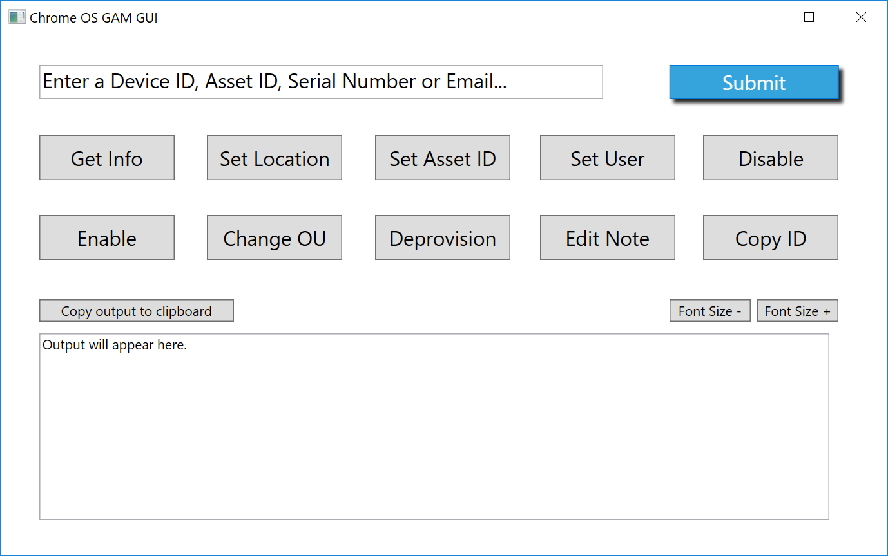
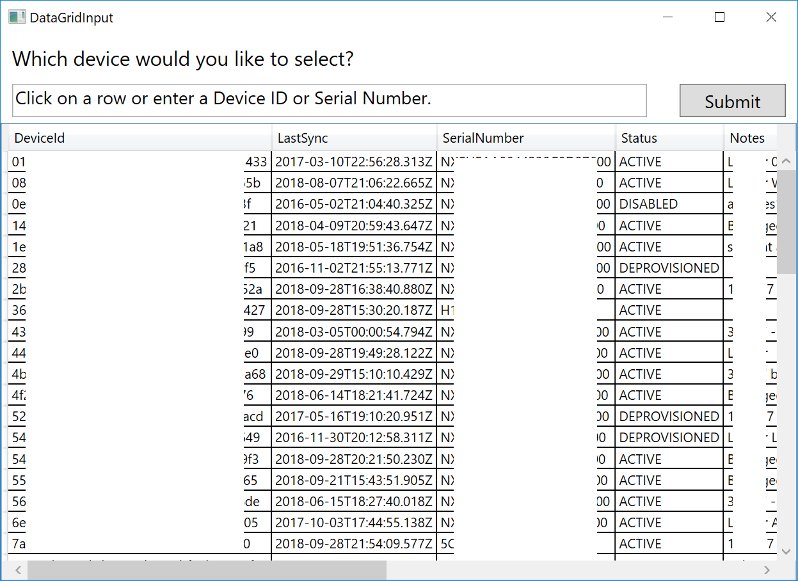
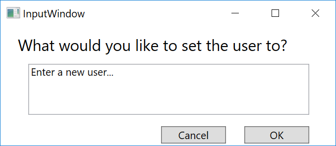
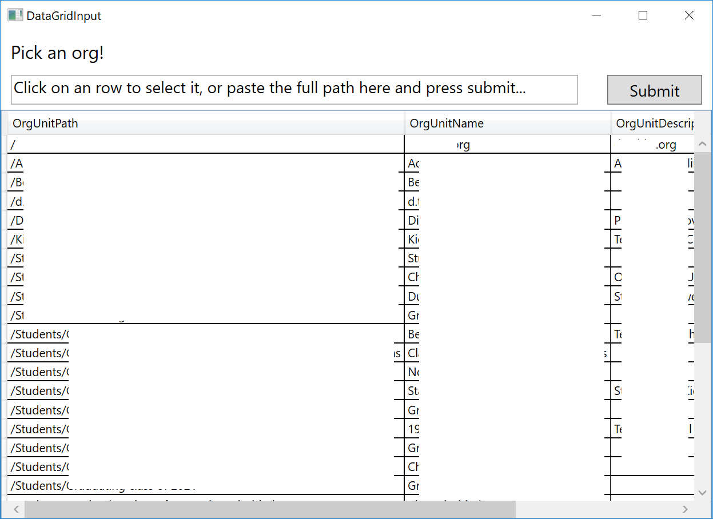
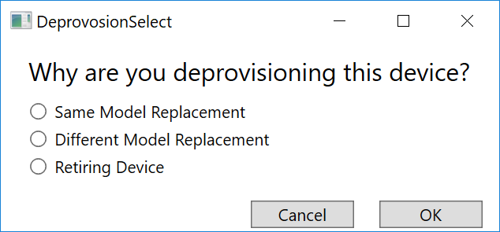
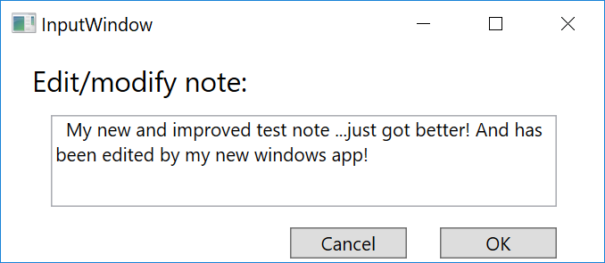
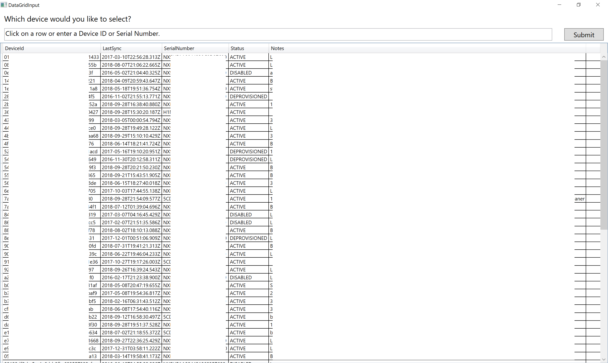

# gam-cros-win-wrapper
## A simple Chromebook management app.

This simple Chromebook management app makes it easy to perform simple Chrome OS Google Admin Console tasks. It's a native app for windows written in C#.

## Installation

#### This app **requires** GAM, from [here](https://github.com/jay0lee/gam).

Before running, make sure that you can run `gam print cros` and from that command you get a bunch of 36 character ids, like this: `90a79523-658p-686y-bf20-19638646153c`. `gam` must be in your PATH.

Installation of this app is simple. Just pop on over to the [releases page](https://github.com/iamtheyammer/gam-cros-win-wrapper/releases/latest), and download the exe. It should run on both x86 and x64 platforms. It's a portable app, so no "installation" is required.

Note: if you'd like the latest build (not verified stable, but *should* work), download the ChromebookGUI.exe file from [ChromebookGUI/bin/Release/ChromebookGUI.exe (or click here!)](https://github.com/iamtheyammer/gam-cros-win-wrapper/raw/master/ChromebookGUI/ChromebookGUI/bin/Release/ChromebookGUI.exe)

#### If you would like an email when this project gets a new release, or you would like to provide a little information about how you found ChromebookGUI, please click [here](https://goo.gl/forms/INpW33oJajuJhyBF2).

## Usage

Using the app is fairly simple, and usability is something I want to work on more.

**The first step is to put a serial number/device ID/email/asset ID into the big box asking for it, then pressing submit.** In the output box, you should see the device ID you're working with.

Now, you can click on any of the buttons.

| Item Title      | Equivalent GAM command | Description |
| :------------- | :---------------------- | :---------- |
| Get info       | `gam info cros $deviceId` | Gets about all there is to know about the device. |
| Set Location | `gam update cros $deviceId location $location` | Sets the device's location |
| Set Asset ID | `gam update cros $deviceId assetid $assetId` | Sets the device's Asset ID |
| Set User | `gam update cros $deviceId user $user` | Set's the device's assigned user |
| Disable | `gam update cros $deviceId disable` | Disables the device, allowing no one to sign into it. |
| Reenable | `gam update cros $deviceId reenable` | Reenables a disabled device. |
| Change OU | `gam update cros $deviceId ou $ou` | Changes the OU of a device. |
| Deprovision | `gam update cros $deviceId $deprovisionReason acknowledge_device_touch_requirement` | Allows you to deprovision a device. |
| Edit Note | `gam update cros $deviceId note $note` | Allows you to update the note on a device. |
| Copy ID | not a single gam command. to find a device id by serial number: `gam print cros query "id:$serialNumber"`, or by user: `gam print cros query "user:$user"` | Takes the current device ID and copies it to the clipboard. |

Output will be displayed in the large box on the bottom of the window. Use the `Copy output to clipboard` button to place the entire output box in the clipboard.

## Screenshots
| Description | Image     |
| :------------- | :------------- |
| Main window, displayed after startup.   |        |
| Main window, maximized (makes output window larger) | 
| Device selection screen. Shown if you enter an email with more than once device. |  |
| Asset ID change window |  |
| Set User window |  |
| Change OU window |  |
| Deprovision window |  |
| Set/change note window |  |

Both the device selection and OU selection screens expand. Click for an expanded image.

 
  
Expanded Device Selection

  
  
Expanded Organizational Unit Selection

  

## Bug reporting
Please open an issue! I want to fix your bugs, I just don't know about them yet. Please include a screenshot with your report.

## In the future (To-Do)
- Add a menu bar with some simple settings
- Add the change OU function-- this will make a radio selector with all of your OUs and let you pick or enter text
- Come up with a name (please help me with this!)

## Contributions
Always welcome! Submit a pull request!

## License
MIT License.
